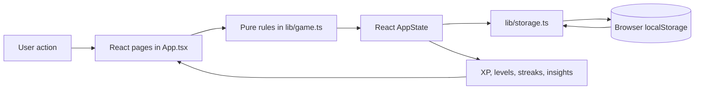

# QuestHabit

**Small quests. Epic growth.**

QuestHabit turns everyday habits into small, repeatable quests. Complete a quest, earn XP, build a streak, and make your progress visible without creating an account or sending personal habit data to a server.

It is designed for people who want more structure and motivation from habit tracking without the overhead of a cloud account. QuestHabit is a frontend-only, local-first React application: Vercel hosts the interface, while your profile and progress remain in your browser.

## Contents

- [Features](#features)
- [Technology](#technology)
- [Getting started](#getting-started)
- [Privacy and local storage](#privacy-and-local-storage)
- [Project structure](#project-structure)
- [Architecture](#architecture)
- [Contributing](#contributing)
- [Roadmap](#roadmap)
- [License](#license)

## Status and badges

[](./LICENSE)
[](https://react.dev/)
[](https://www.typescriptlang.org/)
[](https://vite.dev/)

## Demo and screenshots

There is no public demo URL yet. After deploying, add the genuine URL here.

Screenshots are intentionally not fabricated. To add them:

1. Capture the onboarding, dashboard, and one responsive/mobile view from a real build.
2. Save optimized images under `docs/images/`.
3. Add linked images to this section, with useful alt text.

## Features

### Daily progress

- Local onboarding with display name and avatar selection
- Daily quest board with completion and undo
- XP, levels, ranks, current streak, and longest streak
- Achievement collection derived from completed quests, XP, streaks, and categories

### Quest management

- Create, edit, archive, reactivate, and delete quests
- Search quests and filter by category
- Daily, weekday, and weekly scheduling through the current quest form
- Local date-aware completion records with historical XP values
- Additional `Custom` scheduling support in the domain model for future UI expansion

### Discovery and reflection

- Habit Library templates
- Calendar activity history
- Category-based progress insights
- Avatar selection and cosmetic reward requirements
- Responsive desktop sidebar and mobile navigation

### Personalization and data

- Midnight Violet, Forest Realm, Ember Quest, and Light themes
- JSON export, basic shape-validated import, and local reset
- Recovery messaging for unreadable state and blocked/full browser storage

## Technology

| Technology | Role |
| --- | --- |
| React | UI and page composition |
| TypeScript | Domain and component type safety |
| Vite | Development server and static production build |
| React Router | Browser-side navigation |
| Lucide React | Interface icons |
| Vitest | Pure game-logic tests |
| ESLint and Prettier | Code quality and formatting |
| Browser `localStorage` | Local persistence |

`recharts` and `motion` are declared dependencies for the project's planned analytics and interaction improvements; the current screens use CSS-based presentation and do not yet depend on them at runtime.

## Getting started

Prerequisites: a current Node.js LTS release and npm.

```bash
git clone https://github.com/kumudasrip/QuestHabit
cd QuestHabit
npm install
npm run dev
```

Available commands:

```bash
npm run dev       # Start the Vite development server
npm run typecheck # Run the TypeScript project check
npm run lint      # Run ESLint
npm test          # Run Vitest once
npm run build     # Type-check and create dist/
npm run format    # Format files with Prettier
```

## Privacy and local storage

QuestHabit stores profile details, preferences, quests, completion records, and achievement IDs in one browser storage document under the key `questhabit.state`.

- State is loaded when the React app starts.
- Meaningful state changes are serialized immediately through the storage boundary.
- Refreshing or reopening the deployed site in the same browser profile reads the same local data.
- Another browser, device, private window, or cleared site data has a separate or empty state.
- Storage policies, private browsing, quota limits, or disabled storage can prevent persistence.
- Settings can export a JSON backup and import it after basic shape validation and explicit confirmation.
- Corrupt stored JSON starts a fresh local profile and shows a recovery message.

This is local browser storage, not synchronization. Vercel serves static frontend assets and does not become a database for user progress.

## Project structure

```text
src/
  App.tsx              Route composition, page UI, and interactions
  main.tsx             React entry point
  styles.css           Design system, themes, and responsive layout
  lib/
    game.ts            Quest, XP, date, scheduling, and streak rules
    storage.ts         Validated localStorage load/save boundary
    game.test.ts       Core progression, streak, and schedule tests
docs/
  ARCHITECTURE.md      Component and data-flow explanation
  LOCAL_STORAGE.md     Persistence and privacy details
  ROADMAP.md           Completed work and proposed milestones
.github/
  workflows/ci.yml     Typecheck, lint, test, and build checks
```

## Architecture



The detailed boundaries and extension guidance are in [docs/ARCHITECTURE.md](./docs/ARCHITECTURE.md).

## Contributing

Start with [CONTRIBUTING.md](./CONTRIBUTING.md). Please also read the community expectations in [CODE_OF_CONDUCT.md](./CODE_OF_CONDUCT.md).

Useful contribution areas include templates, achievement definitions, cosmetic packs, themes, accessibility, responsive design, analytics, tests, documentation, and performance. All contributions must preserve the frontend-only, local-first model.

## Roadmap

Completed work and proposed milestones are tracked in [docs/ROADMAP.md](./docs/ROADMAP.md). Discuss substantial proposals through GitHub Issues before starting implementation so contributors do not duplicate work.

## License

QuestHabit is distributed under the [MIT License](./LICENSE).
