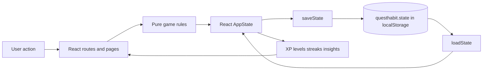

# Architecture

QuestHabit is a static React application with no server runtime. Its three important boundaries are:

1. **UI and interaction** — React components in `src/App.tsx`
2. **Game rules** — pure functions in `src/lib/game.ts`
3. **Persistence** — validated browser storage access in `src/lib/storage.ts`

## Data flow

## Source responsibilities

| Path | Responsibility |
| --- | --- |
| `src/main.tsx` | Mounts the React application and imports global styles |
| `src/App.tsx` | Defines routes, page composition, forms, quest interactions, and derived display values |
| `src/lib/game.ts` | Defines `Quest`, `Completion`, `Profile`, and `AppState`; calculates local dates, schedules, XP levels, ranks, streaks, starter quests, and templates |
| `src/lib/storage.ts` | Loads and validates the top-level state shape, merges defaults, catches malformed reads, and catches write failures |
| `src/styles.css` | Provides the visual system, theme selectors, cards, controls, responsive layout, and mobile navigation |
| `src/lib/game.test.ts` | Exercises level boundaries, duplicate calendar-day streak handling, weekday scheduling, and custom scheduling rules |

The current page and interaction composition is intentionally concentrated in `App.tsx`; the roadmap proposes splitting it into feature modules as the UI grows.

## User action to persistence

1. A user completes or undoes a quest in a page component.
2. The component derives the next immutable `AppState` from the current state.
3. The root `update` callback replaces React state and optionally shows a toast.
4. A React effect calls `saveState`, serializing the state to `questhabit.state`.
5. On a later refresh, `loadState` parses that document, validates required top-level arrays, merges defaults, and returns the state to the root component.

Storage failures are surfaced to the user. A malformed or unreadable state starts a fresh local profile and displays a recovery message; it is not silently presented as successfully restored data.

## Quest completions and XP

Each completion record contains:

- A unique completion ID
- The quest ID
- A local calendar date
- A completion timestamp
- The XP value awarded at completion time

The UI checks for an existing completion with the same quest ID and date before adding one. That prevents repeated clicks from adding another reward for the same quest and local day. Undo removes the matching record; lifetime XP is then derived again from the remaining completion records, so historical XP values are not rewritten when a quest's current reward changes.

## Derived statistics

The application derives:

- Lifetime XP by summing `completion.xp`
- Current level, rank, level XP, and progress from `levelInfo`
- Current and longest streak from unique completion dates through `streak`
- Due quests from quest status, start/end dates, frequency, and local weekday through `dueOn`
- Calendar counts from completion dates
- Category insights from the quest category associated with each completion
- Achievement display state from completion count, XP, streak, quest count, and category count

These values are not stored as competing mutable totals in `AppState`.

## Architectural constraints

- No backend, database, authentication provider, API, serverless function, or cloud synchronization
- User-specific data stays in browser storage unless the user exports it
- Business rules should remain reusable and testable outside React rendering
- Local calendar dates must not be converted through UTC in a way that shifts a completion to another day
- Historical completion rewards must remain attached to their completion records

## Adding a feature

Before adding UI logic, look for an existing rule or storage boundary. Add pure calculations to `src/lib/game.ts` (and tests) rather than duplicating them in a page. Add persistence behavior to `src/lib/storage.ts` rather than writing directly to `localStorage` from a component. Keep the page responsible for presentation and user interaction, then update the relevant documentation and roadmap entry.

## Deployment

Vite emits static assets to `dist/`. React Router runs in the browser. [`vercel.json`](../vercel.json) rewrites incoming paths to `index.html` so direct navigation and refreshes work on Vercel without an API server.
