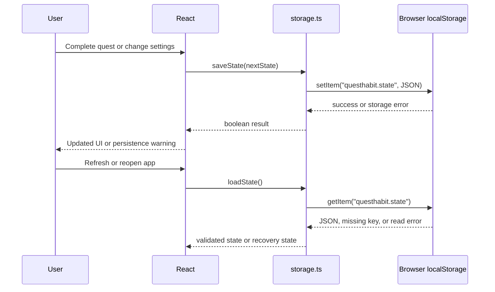

# Local storage and privacy

QuestHabit is local-first by design. There is no account, login, backend, cloud database, or automatic cross-device synchronization.

## What is stored

The app stores one JSON document under:

```text
questhabit.state
```

The document contains:

- Profile information such as display name, avatar, theme, and preferences
- Quest definitions and their schedules
- Completion records, including quest ID, local date, timestamp, and XP earned
- Unlocked achievement IDs

The Settings page can also create a JSON backup file containing the current state.

## Load and save lifecycle

At startup, `src/lib/storage.ts` reads `questhabit.state`. If the key is absent, the app creates a blank state and shows onboarding. If JSON cannot be parsed or required top-level fields are missing, the app starts a fresh state and surfaces a recovery message.

After React state changes, the root component calls `saveState`. The write is synchronous and replaces the JSON document. A failed write returns `false`, and the UI warns that browser storage may be blocked or full. The app does not claim that data was saved when the browser rejected the write.



## Why data persists

Browser storage is associated with the site origin and browser profile. A refresh or later visit to the same deployed Vercel origin can read the same `questhabit.state` document, subject to browser policies and available quota.

The data is not shared automatically between:

- Different browsers
- Different browser profiles
- Different devices
- Private/incognito sessions

Clearing site data, resetting browser storage, or using a browser that blocks storage can remove or prevent access to progress. QuestHabit does not promise guaranteed persistence, encryption, or secure backup.

## Backup and restore

**Export:** Settings serializes the current state to a downloadable `questhabit-backup.json` file.

**Import:** Settings reads a selected file, parses JSON, checks that `profile`, `quests`, and `completions` have the expected top-level shape, and asks for confirmation before replacing the current state. Invalid JSON or missing required arrays is rejected without replacing existing state.

This is basic shape validation, not a cryptographic or complete schema validator. Keep backups in a place you trust and inspect them before sharing. There is no automatic backup service.

## Why there is no synchronization

Automatic synchronization would require a server-side identity and data service, which would change QuestHabit's privacy and architecture. The project deliberately keeps user-specific progress in the browser and uses explicit JSON export/import for moving data between browser profiles or devices.
